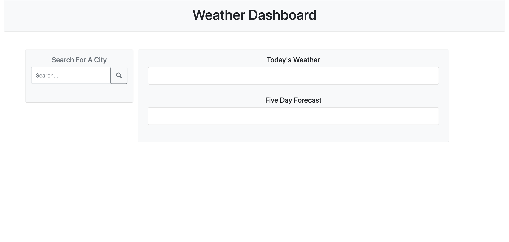
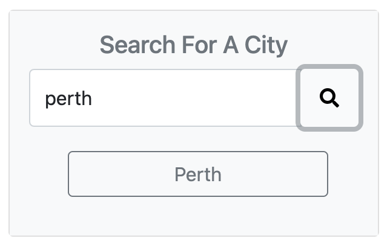
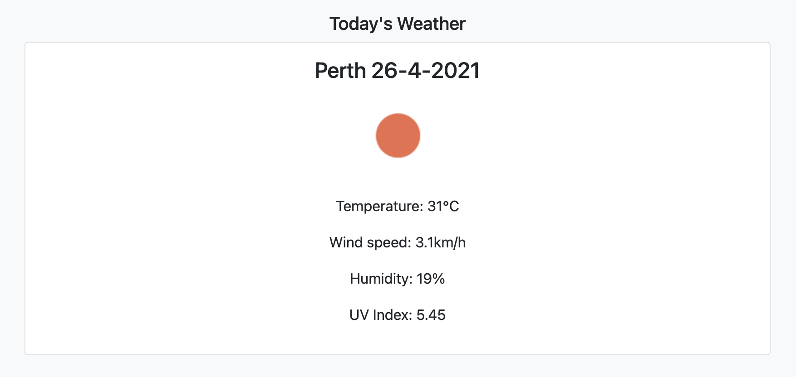
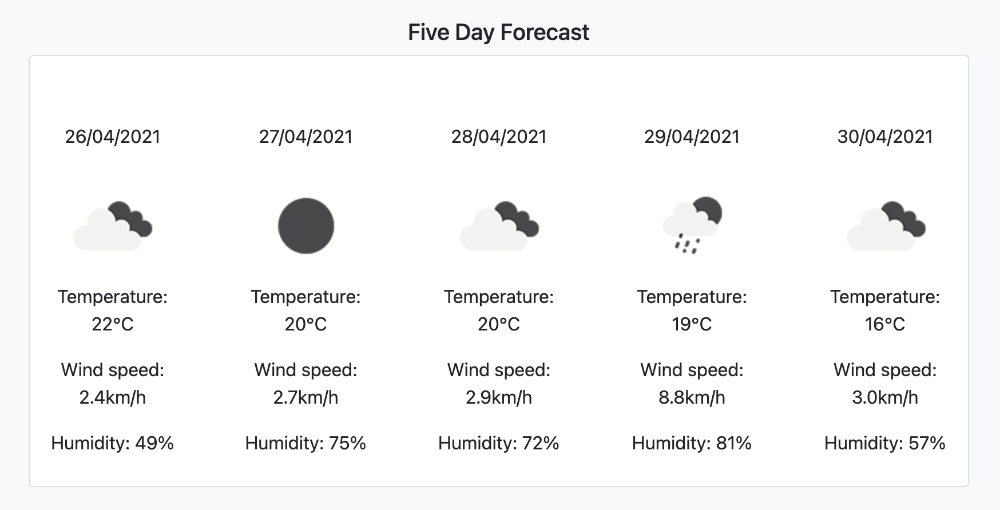

# Weather Dashboard

## Completed by Michael Shaw 
## UWA Coding Bootcamp: Week 6 Homework Assignment

This Weather Dashboard was created for a homework assignment for UWA's coding bootcamp.

This application makes use of JavaScript to display current weather and a 5-day forecast for the selected city. 



### Getting Started

This project has been deployed to GitHub Pages. To use the weather dashboard, you can follow the deployment link. Or, download the source files to use this as a template.

* [Deployed GitHub IO](https://michaelshxw.github.io/weather-dashboard/)
* [GitHub Repository](https://github.com/michaelshxw/weather-dashboard)

### Prerequisites
To install this application, a text editor such as Visual Studio Code is required. This can be downloaded [here.](https://code.visualstudio.com/download)

### Languages Used
* HTML 
* CSS
* JavaScript

### Installation
To install this code, download the zip file, or use GitHub's guidelines to clone the repository

### Summary
* This weather dashboard uses HTML, CSS and JavaScript to display the current and future weather forecast for a selected city.
* This project highlights the use of JavaScript to make dynamic changes to a HTML document.


### Project Features
* A Search Area
    * A user can enter their city and click the search button to display data



* A current weather output section
    * This area is where the current weather for the selected city will be shown.



* A 5-day weather forecast
    * This area is where the 5-day weather forecast for the selected city will be shown.


    
### Project Requirements 

Below is the acceptance criteria that was given for the homework assignment
```
GIVEN a weather dashboard with form inputs
WHEN I search for a city
THEN I am presented with current and future conditions for that city and that city is added to the search history
WHEN I view current weather conditions for that city
THEN I am presented with the city name, the date, an icon representation of weather conditions, the temperature, the humidity, the wind speed, and the UV index
WHEN I view the UV index
THEN I am presented with a color that indicates whether the conditions are favorable, moderate, or severe
WHEN I view future weather conditions for that city
THEN I am presented with a 5-day forecast that displays the date, an icon representation of weather conditions, the temperature, the wind speed, and the humidity
WHEN I click on a city in the search history
THEN I am again presented with current and future conditions for that city
```

### Authors
* **Michael Shaw** (HTML, CSS and JavaScript) [GitHub Profile](https://github.com/michaelshxw)
